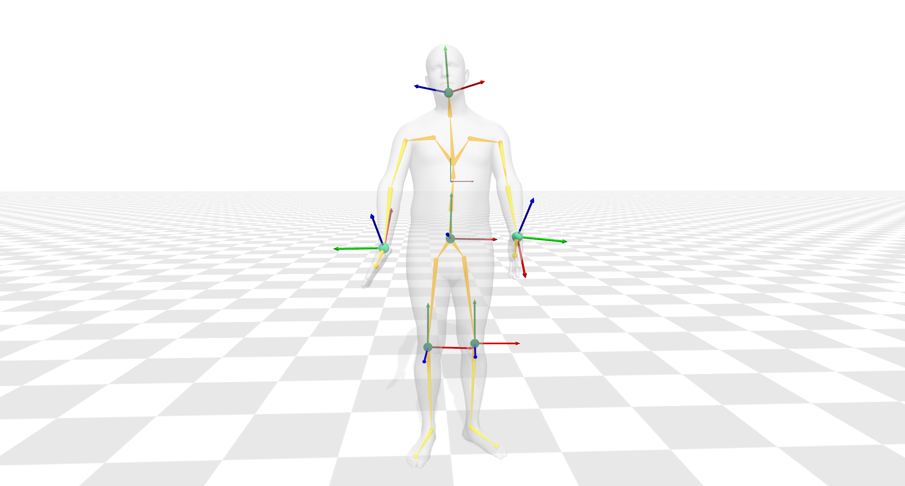

## SMPL conversion and visualization

`cd smpl_vis/`\
&nbsp;&nbsp;`xsens_to_smpl.py` converts the ground truth skeleton poses in the original dataset to SMPL format\
&nbsp;&nbsp;`data_viewer.py` visualizes the ground truth pose with the IMUs (screenshot in the first fig below)\
&nbsp;&nbsp;`result_viewer.py` visualizes the pose estimator output with error map mesh coloring (screenshot in the second figure below)

note:
1. the visualization code needs to be run locally (aitviewer <=  v1.13.0)\
to install aitviewer, follow the instructions from https://github.com/eth-ait/aitviewer
2. most of the paths in `config.py` need to be modified

\

## readme from the dataset repo

# Dataset of "Towards Artefact Aware Human Motion Capture using Inertial Sensors Integrated into Loose Clothing"

This repository contains the some application for the following dataset:
Dataset of "Towards Artefact Aware Human Motion Capture using Inertial Sensors Integrated into Loose Clothing"  
You can get on  
https://zenodo.org/record/5948725   

The data was used in the following publication:__

Towards Artefact Aware Human Motion Capture using Inertial Sensors Integrated into Loose Clothing, **2022 IEEE International Conference on Robotics and Automation**, 2022.  
 **[[Paper](https://www.researchgate.net/publication/359617608_Towards_Artefact_Aware_Human_Motion_Capture_using_Inertial_Sensors_Integrated_into_Loose_Clothing)]** 
   

Data structure:  
The data contains trials of 12 subjects for different motions, wearing at the same time a tight setup with inertial sensors and a loose working suit with integrated inertial sensors. It contains the raw IMU data, raw Magnetometer data and the estimated segment orientations using a Sensor Fusion engine provided by Sci-Track.
Please note, that in the publication only the first 10 subjects were used and the upper body information was used only. The Sternum sensor of the tight setup of subjects 11, 12 and 13  tilted slowly during the long-term measurements. For this reason only 10 subjects were included in the study. However all remaining sensor of the tight setup were not tilted during recording. In particular the lower body recordings of all subjects are not corrupted.   

Repository structure:  
This repo contains some application to vizualize the Dataset. In app you either find an application to vizualize the jointPositions using matplotlib or to vizualize the complete motion using pyqtgraph.
Additionally we included an application to extract the raw measurements from h5 files.

Packages requiered:  
pip install h5py scipy pyqtgraph PyQt5 matplotlib pyopengl
      
 [Michael Lorenz](https://agw.cs.uni-kl.de/en/team), [Bertram Taetz](https://av.dfki.de/members/taetz/), [Gabriele Bleser](https://av.dfki.de/members/bleser/)  

 
